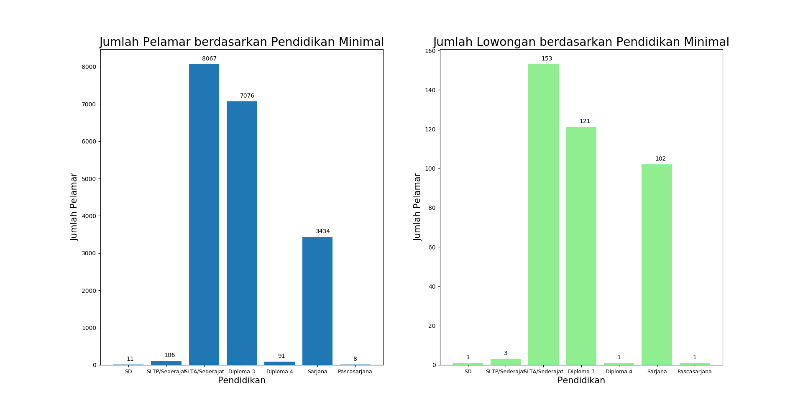

<h1 align="center">
  Hasil Analisis Data Lowongan Pekerjaan
</h1>
<h2 align="center">
Perbandingan antara Lowongan Pekerjaan dan Pelamar Pekerjaan
 
berdasarkan Pendidikan Minimal
</h2>

Hasil visualisasi data di atas menunjukan bahwa lowongan pekerjaan yang diterima kebanyakan meminta tenaga pekerjaan yang memiliki tingkat pendidikan minimal SLTA atau sederajat. Selain itu juga cukup banyak yang mencari tenaga kerja dengan pendidikan minimal D3 dan Sarjana. Dari hasil yang diterima, pelamar dan lowongan yang tersedia terdapat perbedaan yang cukup tinggi. Dengan 153 perusahaan yang mencari terdapat lebih dari 8000 tenaga kerja yang melamar. Jika setiap perusahaan hanya dapat menerima 10 tenaga kerja, terdapat lebh dari 6000 tenaga kerja yang tidak diterima di perusahan-perusahaan tersebut.  
Meskipun banyaknya tenaga kerja yang kemungkinan tidak diterima di perusahaan-perusahaan, dari grafik yang didapatkan menunjukkan bahwa penawaran pekerjaan berbanding lurus dengan permintaan pekerjaan itu sendiri. Misalnya dengan banyaknya perusahaan yang meminta pekerja minimmal SLTA, banyak juga pelamar yang melamar di bagian itu.

<h2 align="center">
Perbandingan antara Lowongan Pekerjaan dan Pelamar Pekerjaan
 
berdasarkan Pengalaman Minimal
</h2>

Hasil v

<h2 align="center">
Perbandingan antara Lowongan Pekerjaan dan Pelamar Pekerjaan
 
berdasarkan Tipe Pekerjaan (Full-Time, Part-Time, Kontrak, Magang)
</h2>

Hasil visualisasi data di atas 

 
 
 
<h5>
Data diambil dari https://jobindo.com/
</h5>